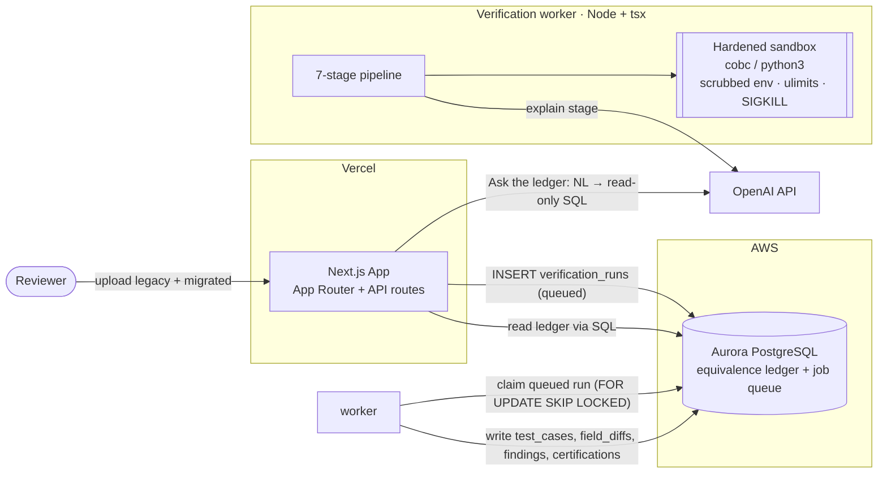

# Parity — Architecture

Parity is an independent verification layer for AI-generated legacy-code migrations.
It runs a legacy program and its migrated counterpart in an isolated sandbox over the
same generated inputs, diffs every output field, localizes divergence, has an LLM
explain it, records everything in a queryable **equivalence ledger**, and issues a
**CERTIFIED / NOT_CERTIFIED** verdict.

## Components (communicate only through the database)

1. **Next.js app (Vercel)** — UI + API route handlers. Creates projects, enqueues runs
   (inserts a `verification_runs` row with status `queued`), serves all ledger data back
   via SQL, and hosts the NL→SQL ledger copilot. Does no heavy execution.
2. **Verification worker (Node + TypeScript)** — polls for queued runs, runs the 7-stage
   pipeline, shells out to `cobc`/`cobcrun` (GnuCOBOL) and `python3` inside a hardened
   sandbox, writes all evidence to the ledger, sets the verdict.
3. **Aurora PostgreSQL** — the equivalence ledger **and** the job queue. The only data store.

Data flow: UI POST → `verification_runs` (`queued`) → worker claims (`running`) → worker
writes `test_cases`, `legacy_runs`, `migrated_runs`, `field_diffs`, `findings`,
`certifications` → run set `completed` with verdict → UI polls and renders from the ledger.

## Database wiring (single source of truth)

Both the app and the worker connect through `lib/db.ts`, which **prefers `DATABASE_URL`**.
Set the same Aurora connection string in both places so the ledger is one database:

| Surface | Set `DATABASE_URL` to |
| --- | --- |
| Vercel project env | Aurora cluster (`...rds.amazonaws.com:5432/<db>?sslmode=require`) |
| Worker (local / Fargate) | the **same** Aurora cluster |
| Local dev (docker compose) | `postgres://parity:parity@db:5432/parity` (no TLS) |

Fallback: on a Vercel deploy with **no** `DATABASE_URL`, `lib/db.ts` uses Aurora IAM auth
via the Vercel OIDC token (`AWS_ROLE_ARN` + `VERCEL_OIDC_TOKEN`). `DATABASE_URL` is the
recommended path because it keeps app and worker on the same cluster without token expiry.

## The 7-stage pipeline

1. **Generate** N inputs (default 10,000) + boundary cases → `test_cases`.
2. **Execute legacy (oracle)** — compile once (`cobc -x -free -o legacy legacy.cbl`), run → `legacy_runs`.
3. **Execute migrated** — `python3 migrated.py inputs.csv migrated_outputs.csv` → `migrated_runs`.
4. **Equivalence + masking** — per-field tolerance + mask hook.
5. **Compare + localize** — a `field_diffs` row per case per field; aggregate into `findings`.
6. **Explain (LLM)** — per finding, sampled tuples → root cause + suggested fix.
7. **Certify** — `NOT_CERTIFIED` if any finding, else `CERTIFIED`; insert `certifications`.

The worker stamps `verification_runs.stage` per phase so the UI shows real progress.

## Sandbox (untrusted code)

Uploaded code runs only in the worker, never in the Next.js layer. `engine/sandbox.ts`:
scrubbed environment (no `DATABASE_URL` / `OPENAI_API_KEY` / AWS creds reach the child),
`ulimit` caps (address space, CPU, file size, processes), a captured-output cap, and a
SIGKILL of the whole process group on wall-time/output breach. Optional network isolation
via `PARITY_SANDBOX_UNSHARE=1` (`unshare -n`).

## Ledger copilot (NL → SQL)

`POST /api/runs/[id]/ask` turns a natural-language question into one read-only SQL query
over this run's ledger. Defense in depth: keyword denylist + single-statement check →
forced `LIMIT` → execution inside a **read-only transaction** with a statement timeout.
The LLM is never trusted to write.
